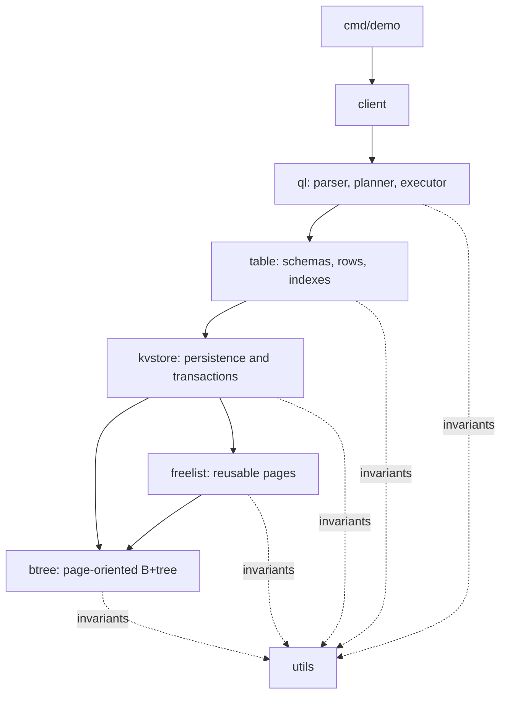

# GoDB

GoDB is a small, educational relational database written from scratch in Go.
It includes its own page-oriented B+tree, persistent key-value store,
transactions, table and index layer, SQL-like query language, query planner,
and high-level client API.

The project is intended for learning and experimentation. It demonstrates how
the layers of a database fit together without hiding the storage engine behind
a large framework. It is not intended to replace a production database.

## Credits

This project is based on the ideas and implementation developed in
[*Build Your Own Database From Scratch in Go*](https://build-your-own.org/database/)
by James Smith, published by [build-your-own.org](https://build-your-own.org/).
In particular, the original storage, transaction, table, and query-language
design follows the later chapters of the book.

GoDB extends and reorganizes that implementation with a layered package
structure, a linked-leaf B+tree format, automatic index planning, a decoded
result layer, and a simpler public client API. These additions are project
extensions and should not be attributed to the book.

## Features

- Persistent, page-oriented storage in a single database file.
- A B+tree with distinct internal and leaf page layouts.
- Bidirectional links between leaf pages for ordered traversal.
- Variable-length byte-string keys and values.
- Reusable disk pages through a version-aware free list.
- Snapshot-based key-value transactions with optimistic conflict detection.
- Atomic persistence using ordered writes, `fsync`, and a metadata root page.
- Tables with typed columns, composite primary keys, and secondary indexes.
- Automatic maintenance of secondary indexes during inserts, updates, and
  deletes.
- A compact SQL-like query language supporting:
  - `CREATE TABLE`
  - `INSERT`, `UPSERT`, and `REPLACE`
  - `SELECT`
  - `UPDATE`
  - `DELETE`
  - `FILTER` expressions and `LIMIT`
- A conservative query planner that automatically selects a usable index.
- Full primary-index scan fallback for expressions the planner cannot safely
  optimize.
- A high-level client that owns database lifecycle and transaction handling.
- Materialized query results decoded into Go `int64` and `string` values.

## Improvements beyond the book implementation

### Linked-leaf B+tree

Internal and leaf pages use separate formats. Leaf pages contain physical
`previous` and `next` pointers, forming a bidirectional list. The links are
maintained through inserts, copy-on-write replacements, splits, deletes,
merges, and root transitions.

Normal B+tree iterators cross page boundaries through leaf links. Historical
transaction snapshots retain root-to-leaf traversal because their immutable
data pages may belong to an older tree version.

### Automatic query planning

Queries do not accept or require an `INDEX BY` hint. The planner examines
simple predicates in the `FILTER` expression and selects an index when its
leading columns are covered by:

- One or more equality predicates.
- An equality prefix followed by a range predicate.
- An open or bounded range on the leading indexed column.

The complete filter is always evaluated on candidate rows, so index selection
only affects performance. Computed expressions, `OR` expressions, ambiguous
bounds, non-leading index columns, and other unsupported patterns safely fall
back to a full primary-index scan.

### High-level client API

Applications can use the `client` package without importing the lower-level
query, table, transaction, or storage packages. Each call to `Query` executes
one statement in its own transaction, materializes selected rows, and commits
or aborts automatically.

### Decoded results

The client returns query rows as native Go values instead of exposing the
table layer's byte representation:

```text
{id: 2, name: Grace}
{id: 3, name: Linus}
```

Integer columns become `int64` and byte-string columns become `string`.
Lower-level APIs remain available for callers that need binary-safe `[]byte`
values.

## Architecture

The implementation is split into one-way dependency layers:



| Package | Responsibility |
| --- | --- |
| `client` | Public lifecycle and query API; automatic transactions and decoded results. |
| `ql` | Query parser, expression evaluator, automatic planner, executor, and result decoding. |
| `table` | Schemas, typed records, primary keys, secondary indexes, and table transactions. |
| `kvstore` | Memory-mapped file access, copy-on-write page persistence, snapshots, and conflict detection. |
| `btree` | B+tree page format, lookup, update, delete, split/merge logic, and iterators. |
| `freelist` | Persistent, version-aware queue of reusable page pointers. |
| `utils` | Shared internal assertions and small helpers. |
| `cmd/demo` | Runnable end-to-end example. |

## Requirements

- Go 1.21 or newer.
- A Unix-like operating system. The storage layer currently uses `mmap`,
  `fsync`, and related system calls.

## Installation

To use GoDB as a library:

```sh
go get github.com/obayona/godb
```

Import only the client package for the high-level API:

```go
import "github.com/obayona/godb/client"
```

To clone the repository and run it locally:

```sh
git clone https://github.com/obayona/godb.git
cd godb
go test ./...
go run ./cmd/demo
```

The demo creates a temporary `demo.db`, creates and indexes a table, inserts
records, runs indexed and full-scan filters, deletes a record, prints the
remaining rows, and removes the file when it exits.

## Client usage

```go
package main

import (
	"fmt"
	"log"

	"github.com/obayona/godb/client"
)

func main() {
	db, err := client.Open("app.db")
	if err != nil {
		log.Fatal(err)
	}
	defer db.Close()

	_, err = db.Query(`
		create table users (
			id int,
			name bytes,
			email bytes,
			age int,
			primary key (id),
			index (email),
			index (age)
		)
	`)
	if err != nil {
		log.Fatal(err)
	}

	_, err = db.Query(`
		insert into users (id, name, email, age)
		values (1, 'Ada', 'ada@example.com', 36),
		       (2, 'Grace', 'grace@example.com', 28)
	`)
	if err != nil {
		log.Fatal(err)
	}

	result, err := db.Query(`
		select id, name
		from users
		filter email = 'grace@example.com'
	`)
	if err != nil {
		log.Fatal(err)
	}

	for _, row := range result.Rows {
		fmt.Println(row)
		fmt.Println("name:", row.Get("name"))
	}
}
```

`client.Result` contains:

- `Rows []client.Row` for selected records.
- `Added` for inserted records.
- `Updated` for inserted or updated records.
- `Deleted` for deleted records.

`Client.Close` is idempotent. A closed client can be opened again with another
database path.

## Query examples

```sql
-- Automatically uses the email index.
select id, name from users filter email = 'grace@example.com'

-- Automatically uses the age index as a bounded range.
select id, name, age from users filter age >= 30 and age < 40

-- Falls back to a full scan because the predicate is computed.
select id, name from users filter name + '!' = 'Ada!'

update users set name = 'Amazing Grace' filter id = 2

delete from users filter id = 1
```

The language uses `FILTER` rather than SQL's `WHERE`. It is intentionally
small and should be considered SQL-like rather than a complete SQL dialect.

## Testing

Run all package tests with:

```sh
go test ./...
```

The test suite includes B+tree split/merge and leaf-link validation, free-list
stress tests, persistence and failure recovery, transaction conflicts, table
and index behavior, query planning, decoded results, and client lifecycle.

## Current limitations

- No prepared statements or parameter binding.
- No protection against query injection when statements are built from
  untrusted input.
- No joins, foreign keys, aggregation, or schema migrations.
- Only integer and byte-string column types are implemented.
- The client executes one statement per transaction.
- The storage engine is Unix-specific and educational rather than
  production-hardened.

## On-disk compatibility

The current linked-leaf page format uses the database signature
`GoDBLinkedLeaf01`. It is not binary-compatible with database files produced
by the earlier node format.
